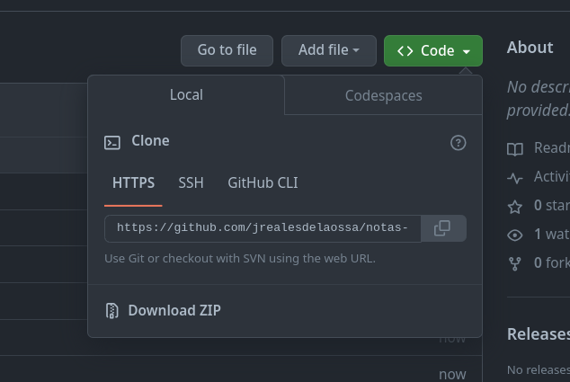
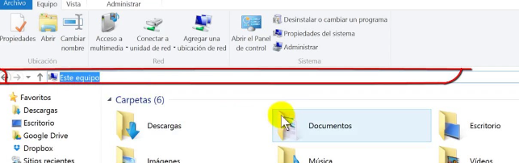
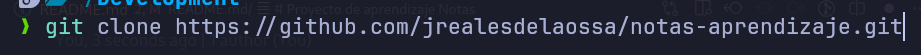
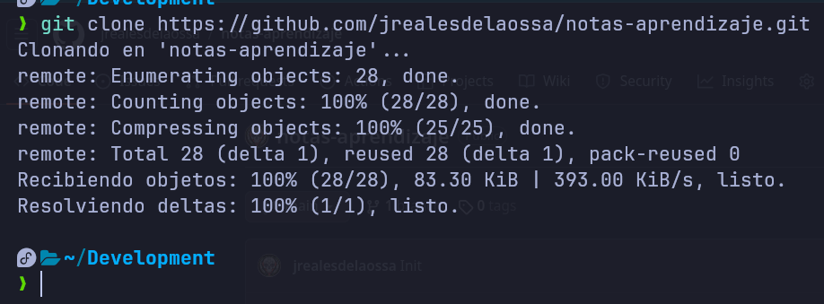
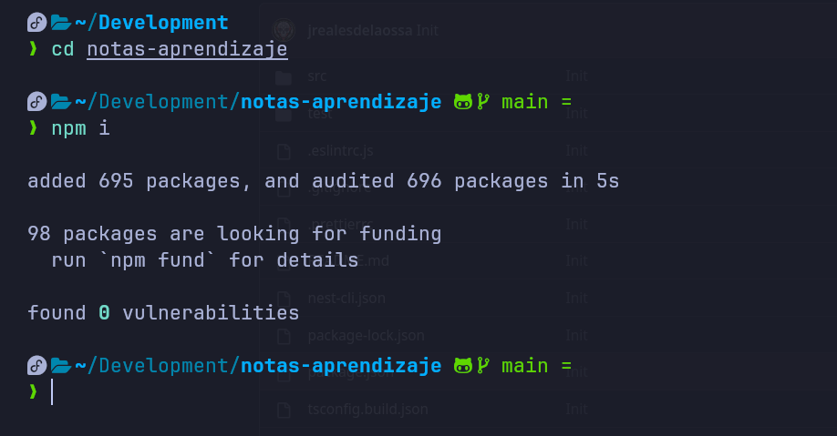

# Proyecto de aprendizaje Notas

Primero busca en la página del repositorio el botón que dice code y cuando se abra la ventana buscas la que dice **HTTPS** y le das clic, luego copias la cadena que está abajo.

Luego abres el explorador de archivos y te ubicas en la carpeta donde están los proyectos y le das clic en la ruta del explorador, escribes **cmd** como te mostré ayer y le das enter.

Si lo hiciste bien, que se que si. Te abrirá la terminal.

en la terminal escribe `git clone [la cadena que te dije que copiaras]` y se debe de ver algo asi:

le das enter y cuando termine debe verse asi:

Ahora desde la termina debes entrar en el proyecto escribiendo `cd notas-aprendizaje`(cd es para entrar en una carpeta y notas-aprendizaje es el nombre de la carpeta), cuando hagas eso escribes `npm i` y le das enter para que se instalen las dependencias del proyecto.

Cuando termine se debe de ver asi:

Y listo, ahora ya puedes abrir el proyecto en visual studio y seguir.
